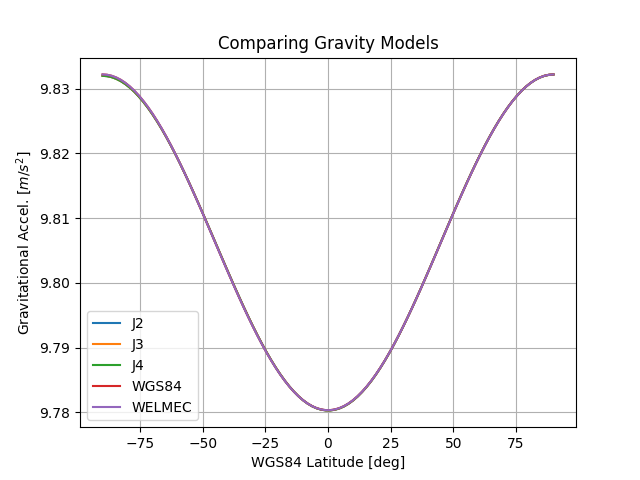

# Gravity Model Comparison

**Code By:** Michael Wrona

Code to do a quick comparison of basic earth gravity models.

## Resources

* https://www.mathworks.com/help/aerotbx/ug/comparing-zonal-harmonic-gravity-model-to-other-gravity-models.html
* https://ntrs.nasa.gov/api/citations/20060028164/downloads/20060028164.pdf
